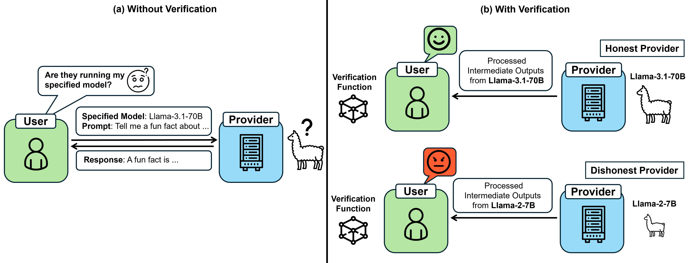
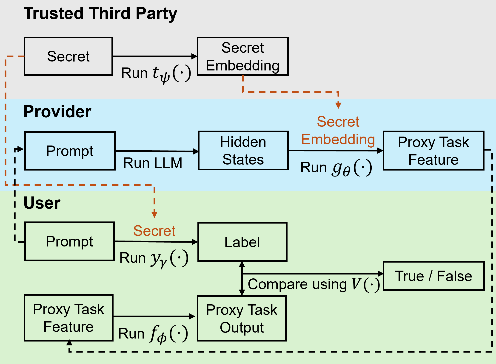

# SVIP: Towards Verifiable Inference of Open-Source Large Language Models

<p align="center">
  
</p>

This repository contains the implementation of [**SVIP**](https://arxiv.org/abs/2410.22307), a secret-based verifiable LLM inference protocol. SVIP is designed to address a critical security issue when users rely on computing providers for LLM inference via black-box APIs: *the providers may stealthily substitute the requested LLM with a smaller, less capable model to save resources, compromising output quality while still charging users for the larger model.*

Our protocol leverages the **hidden states** of the LLM as unique model identifiers to verify whether the correct model is used during inference. A well-designed proxy task model is trained exclusively on the hidden states produced by the requested model. During deployment, the computing provider is required to return both the generated text and the corresponding hidden states of the LLM to the user, who can then verify whether the requested LLM is used for inference by assessing the performance of the proxy task model on these hidden states. If the proxy task model performs well, it provides strong evidence that the correct LLM was used. To further enhance security, SVIP incorporates a **secret-based mechanism**, making it difficult for a malicious computing provider to fake or bypass the verification process. 

We have conducted extensive experiments with 5 widely-used open-source LLM ranging from 13B to 70B parameters, demonstrating that SVIP achieves **false negative rates below 5%** and **false positive rates under 3%**, while requiring less than **0.01 seconds per query** for verification. Furthermore, SVIP has shown remarkable robustness against various adaptive adversarial scenarios, proving to be an accurate, generalizable, computationally efficient, and secure solution for verifiable LLM inference.

Please refer to our paper for more details.

## Protocol Overview
<p align="center">
  
</p>

SVIP involves three parties: a trusted third party, a computing provider, and a user. Here's how the process works:

1. **Protocol Setup**:
   - The trusted third party prepares a **labeling network** and trains a **proxy task model** specific to the LLM chosen by the user.
   - The **proxy task model** includes a **proxy task feature extractor** and a **proxy task head**. The **proxy task feature extractor** is sent to the computing provider, while the **proxy task head** and the **labeling network** are given to the user.
   - Additionally, a **secret embedding network** is trained to handle the secret mechanism, and it is kept only by the trusted third party.

2. **Secret Generation**:
   - The trusted third party randomly generates a **secret** for the user.
   - The corresponding **embedded secret**, generated by the secret embedding network, is sent to the computing provider.

3. **Inference and Verification**:
   - The user sends a prompt to the computing provider for inference.
   - The computing provider runs the LLM, processes the hidden states along with the **embedded secret** using the proxy task feature extractor, and returns the resulting **proxy task feature** to the user.
   - The user computes the expected **label vector** using the **labeling network** based on the prompt and secret, applies the **proxy task head** on the **proxy task feature** to get the **proxy task output**, and compares the two vectors. If the L-2 distance between them is below a pre-defined threshold, the results are considered a match, indicating that the provider has used the requested LLM.

4. **Protocol Update**:
   - To defend against potential adaptive attacks, our protocol incorporates an update mechanism:
     - Once a secret is used for *M* queries, the next secret is activated. Additionally, there is a minimum time limit between secret activations, preventing attackers from collecting too many secrets within a short period.
     - When a total of *N* secrets have been used, the entire protocol should be retrained, starting from step 1.
     - The values of *M* and *N* can be determined empirically. 
  

## Conda Environment Setup
Our implementation is tested on Python 3.10 and PyTorch 2.4.0. Follow the steps below to set up the conda environment:

```
# Remove the old environment, if necessary.
conda deactivate; conda env remove --name SVIP
# install all dependencies
conda env create -f environment.yaml --name SVIP
# activate the environment
conda activate SVIP
```
  

## Dataset Generation

**Preprocess the text dataset** used for protocol training. The preprocessed dataset will be saved to `datasets/text_dataset_train.json`.

```
python dataset_preprocess.py --dataset_name lmsys/lmsys-chat-1m
```
**Create the hidden states cache dataset.** Since the proxy task model is trained on the hidden states produced by the requested LLM over multiple epochs, caching the hidden states significantly reduces training time. Use the `--model_name` option to specify the LLM to be used. This dataset will be saved to `datasets/`.
```
python create_hidden_state_dataset.py --model_name meta-llama/Llama-2-13b-hf
```

## Protocol Training
The **trusted third party** first trains a **labeling network** using the preprocessed text dataset. To start training, use `train_labeling_model.py` and specify the configuration file and dataset paths:

```
python train_labeling_model.py --config_path ./run_configs/train_labeling_model.yaml --dataset_path ./dataset/text_dataset_train.json
```
After completing the first step, the labeling network will be saved to `./models/Ymodel.pth`. Next, the trusted third party trains the **proxy task model** and the **secret embedding network** for the requested LLM. Use `train_proxy_task_model.py` and specify the configuration file. Example configuration files are provided in the `run_configs` folder, with filenames starting with `train_proxy_`. For example, for the `Llama-2-13b` model, run: 

```
python train_proxy_task_model.py --config_path ./run_configs/train_proxy_llama13b.yaml
```

The trained models, including the proxy task model and the secret embedding network, will be saved in the `models` folder as a single file. Then, the trusted third party splits the model and sends the **proxy task feature extractor** to the computing provider and the **proxy task head** to the user.

## Protocol Evaluation
### Accuracy Evaluation
We evaluate the accuracy of our protocol by measuring the false negative rate(FNR) on the requested model and the false positive rate(FPR) on 6 widely-used LLMs as alternative models. The evaluation process involves calculating the empirical distribution of the L-2 distance between the label vector and the proxy task output for each model.

To evaluate, use the `--model_name` option to specify the requested model and use the same configuration file used for proxy task model training:

  ```
  python evaluate.py --model_name meta-llama/Llama-2-13b-hf --verification_model_path ./models/Llama-2-13b-hf/proxy_model.pth --data_file <test_dataset_path> --run_config ./run_configs/train_proxy_llama13b.yaml
  ```

The results will be saved in the `pipeline_evaluation_results` folder as a `.pkl` file. Then, you can use the `show_evaluate_result.py` script to calculate the FNR and FPR. Specify the result file generated in the previous step using the `--evaluate_result_path` option and set the threshold for classification using the `--threshold` option. 
  ```
  python show_evaluate_result.py --evaluate_result_path <result_file_path> --threshold <threshold>
  ```
This script will also generate a visualization of the empirical distribution of the L-2 distances and save it as `results/evaluation_result.png`

### Robustness Evaluation
We also provide implementations of several potential attacks against our protocol, including:

- **Adapter attack:** This attack can be implemented once the attacker collects enough prompt samples under a single secret. The goal is to train an adapter that mimics the **proxy task feature**, but by using a smaller alternative LLM. To conduct this attack, first train the adapter using the hidden states of both the requested LLM and the alternative LLM, specified by the `--file_name_1` (target model hidden states cache) and `--file_name_2` (alternative model hidden states cache) options. Then, evaluate the performance of the proxy task model on the alternative LLM combined with the adapter. Specify the proxy task model with the `--verification_model_path` option, and use the same configuration file used for proxy task model training.
```
# Train the adapter
python distillation_train_single_secret.py --file_name_1 <target_model_cache_hidden_states> --file_name_2 <alternative_model_cache_hidden_states> --verification_model_path <verfication_model_path> --run_config ./run_configs/train_proxy_llama13b.yaml
# Then evaluate the attack
python evaluate_attack_single_secret.py --verification_model_path <verfication_model_path> --data_file <test_dataset_path> --distillation_models_path <alternative_model_with_adapter_path> --run_config ./run_configs/train_proxy_llama13b.yaml
```

-  **Secret Recovery Attack:**  In this attack, the attacker attempts to recover the secret from the embedded secret after collecting a dataset of **secret** and **embedded secret** pairs. By recovering the secret, the attacker could reveal the expected label vector and generate the corresponding proxy task feature. Use `secret_recover_attack.py` for this attack and specify the proxy task model and secret embedding network with the `--model_path` option, and use the same configuration file used for proxy task model training.
```
python secret_recover_attack.py --model_path ./models/Llama-2-13b-hf/proxy_model.pth --config_path ./run_configs/train_proxy_llama13b.yaml --dataset_path <test_dataset_path>
```


## Citation
If you find our project helpful, please cite our paper:
